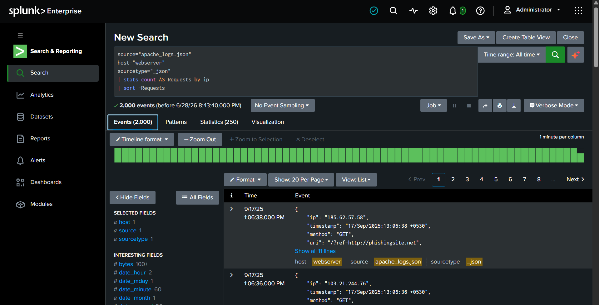
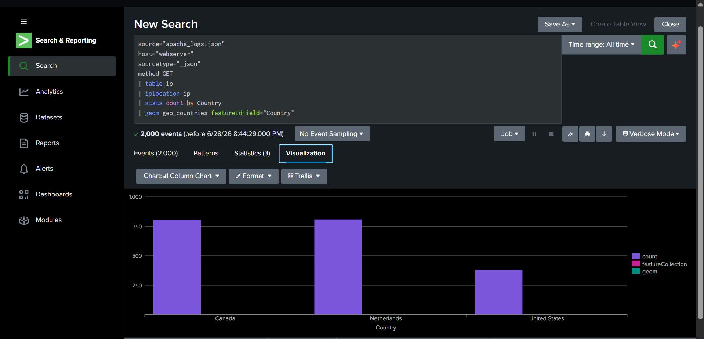
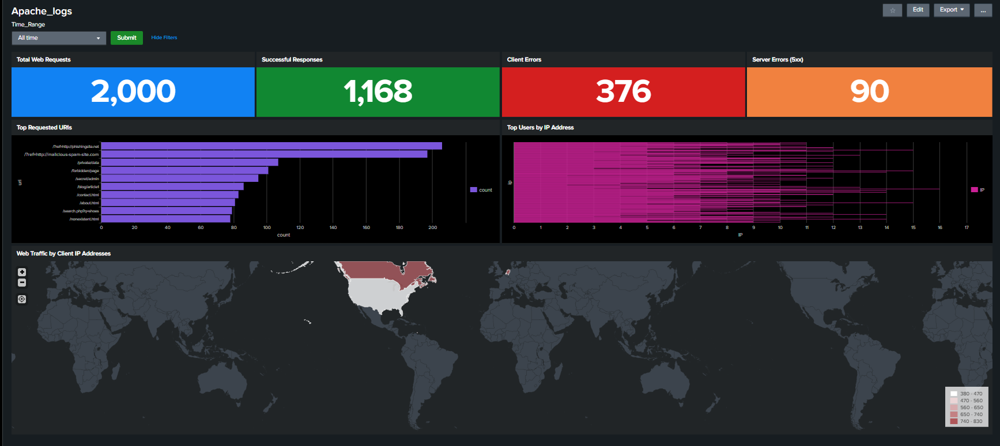

# Project 2 - Apache Web Traffic Monitoring Dashboard Using Splunk

## Overview

Web server logs provide valuable insight into user activity, application performance, and potential security threats. Security Operations Center (SOC) analysts continuously monitor these logs to identify suspicious requests, unauthorized access attempts, abnormal traffic patterns, and server-side issues.

In this project, I built an interactive Splunk dashboard using Apache web server logs. The dashboard visualizes key web traffic metrics, including total requests, successful responses, HTTP errors, frequently requested resources, client IP activity, and geographic traffic distribution. These visualizations provide a centralized view of web activity and support both operational monitoring and security investigations.

---

# Objectives

The objectives of this project are to:

* Import Apache web server logs into Splunk Enterprise
* Configure an interactive dashboard using a shared time picker
* Monitor overall web activity
* Analyze HTTP response codes
* Identify the most frequently accessed resources
* Monitor client IP activity
* Visualize geographic distribution of web traffic
* Develop practical SPL skills for web log analysis

---

# Lab Environment

| Component     | Details                       |
| ------------- | ----------------------------- |
| SIEM Platform | Splunk Enterprise             |
| Dataset       | apache_mixed_access_full.json |
| Log Format    | JSON                          |
| Sourcetype    | _json                         |
| Host          | webserver                     |

---

# Dashboard Configuration

Before creating dashboard panels, a shared time picker was configured to provide consistent filtering across all visualizations.

### Time Picker Configuration

Navigation

```
Dashboard → Add Input → Time
```

Configuration

* Label: **Time Range**
* Token: **time_range**

A Submit button was also added so all dashboard panels refresh simultaneously when the selected time range changes.

# Screenshot
>heh


---

# Task 1 – Web Activity Overview

The first section of the dashboard provides a high-level summary of web server activity.

---

## Total Web Requests

This panel displays the total number of requests received by the web server.

### SPL Query

```spl
source="apache_logs.json"
host="webserver"
sourcetype="_json"
| stats count AS "Total Web Requests"
```

### Security Insight

A sudden increase in total requests may indicate increased user activity, automated scanning, denial-of-service attempts, or other abnormal traffic patterns.


---

## Successful Responses (HTTP 200)

This panel counts successful GET requests processed by the server.

### SPL Query

```spl
source="apache_logs.json"
host="webserver"
sourcetype="_json"
method=GET status=200
| stats count AS "Successful Responses"
```

### Security Insight

Monitoring successful responses establishes a baseline of normal application usage and helps compare legitimate traffic against abnormal activity.


---

## Client Errors (HTTP 4xx)

This panel identifies requests that resulted in client-side errors.

### SPL Query

```spl
source="apache_logs.json"
host="webserver"
sourcetype="_json"
| where status>=400 AND status<500
| stats count AS "Client Errors"
```

### Security Insight

Large numbers of HTTP 404 or 403 responses may indicate:

* Directory enumeration
* Forced browsing
* Broken application links
* Unauthorized access attempts


---

## Server Errors (HTTP 5xx)

This panel identifies requests that resulted in server-side failures.

### SPL Query

```spl
source="apache_logs.json"
host="webserver"
sourcetype="_json"
| where status>=500 AND status<600
| stats count AS "Server Errors"
```

### Security Insight

HTTP 5xx responses may indicate backend application failures, unavailable services, or resource exhaustion. Persistent server errors should be investigated immediately.


---

# Task 2 – Web Traffic Statistics

The second section of the dashboard focuses on identifying the most active resources and users.

---

## Top Requested URIs

This visualization identifies the resources most frequently requested by users.

### SPL Query

```spl
source="apache_logs.json"
host="webserver"
sourcetype="_json"
| stats count AS Hits by uri
| sort -Hits
```

### Security Insight

Frequently requested resources represent the application's most accessed endpoints. Unexpected requests for administrative or sensitive paths may indicate reconnaissance or exploitation attempts.
 


---

## Top Client IP Addresses

This visualization identifies the most active client IP addresses.

### SPL Query

```spl
source="apache_logs.json"
host="webserver"
sourcetype="_json"
| stats count AS Requests by ip
| sort -Requests
```

### Security Insight

Monitoring client IP activity helps identify heavy users, automated bots, or suspicious hosts generating unusually high request volumes.

# screenshot



---

# Task 3 – Geographic Traffic Analysis

Understanding the geographic origin of web traffic helps analysts detect unusual access patterns and identify unexpected client locations.

### SPL Query

```spl
source="apache_logs.json"
host="webserver"
sourcetype="_json"
method=GET
| table ip
| iplocation ip
| stats count by Country
| geom geo_countries featureIdField="Country"
```

### Security Insight

GeoIP enrichment allows analysts to visualize client activity by country. Unexpected traffic from unfamiliar regions may warrant additional investigation, particularly for administrative applications.

# Screenshot



---

# Dashboard Summary

The completed dashboard contains the following visualizations:

* Total Web Requests
* Successful Responses
* Client Errors (4xx)
* Server Errors (5xx)
* Top Requested URIs
* Top Client IP Addresses
* Geographic Traffic Distribution

# Screenshot



---

# Key Findings

During this project, I successfully:

* Imported Apache access logs into Splunk Enterprise
* Built an interactive dashboard using a shared time picker
* Monitored web activity through multiple visualizations
* Analyzed HTTP response codes
* Identified frequently requested resources
* Investigated client IP activity
* Visualized global web traffic using GeoIP enrichment

---

# Skills Demonstrated

* Splunk Enterprise
* Search Processing Language (SPL)
* Apache Web Log Analysis
* Dashboard Development
* GeoIP Enrichment
* Data Visualization
* Security Monitoring
* Log Investigation

---

# Future Improvements

This dashboard can be extended by implementing additional security-focused detections, including:

* Detection of repeated HTTP 404 responses
* Directory brute-force detection
* SQL Injection pattern identification
* Cross-Site Scripting (XSS) detection
* Suspicious User-Agent monitoring
* High request-rate detection
* Automated Splunk alerts
* MITRE ATT&CK mapping for web-based attack techniques

---

# Key Takeaways

This project demonstrates how Splunk dashboards can transform raw Apache access logs into actionable operational and security insights. By combining SPL queries with visualizations, it becomes easier to monitor web traffic, identify abnormal behavior, and support SOC investigations.

Building this dashboard strengthened my understanding of log ingestion, dashboard development, HTTP analysis, and practical Splunk workflows that are commonly used by security analysts in real-world environments.
