# Project 03 - DNS Traffic Analysis Using Splunk

## Overview

The **Domain Name System (DNS)** is one of the most critical network protocols and is frequently abused by attackers for command-and-control (C2) communication, malware delivery, phishing, domain generation algorithms (DGA), and DNS tunneling. Since almost every network connection begins with a DNS request, monitoring DNS traffic is a fundamental responsibility of Security Operations Center (SOC) analysts.

In this project, I imported **Zeek DNS logs** into **Splunk Enterprise** and used **Search Processing Language (SPL)** to analyze DNS activity. The project focuses on identifying frequently queried domains, active client hosts, DNS record types, failed DNS resolutions, response times, and DNS server activity. These analyses help establish normal DNS behavior while enabling analysts to detect suspicious or abnormal network activity.

---

# Objectives

The objectives of this project are to:

* Import Zeek DNS logs into Splunk Enterprise
* Understand the structure of DNS log fields
* Analyze DNS traffic using SPL
* Identify the most frequently queried domains
* Monitor client DNS activity
* Analyze DNS record types
* Detect failed DNS resolutions
* Measure DNS response latency
* Investigate DNS server usage
* Develop practical DNS investigation skills used in SOC environments

---

# Lab Environment

| Component     | Details              |
| ------------- | -------------------- |
| SIEM Platform | Splunk Enterprise    |
| Dataset       | dns_logs.json        |
| Log Format    | JSON (Zeek DNS Logs) |
| Sourcetype    | json                 |
| Index         | dns_lab              |

---

# Data Ingestion

Before beginning the analysis, the DNS dataset was uploaded into Splunk.

### Navigation

```text
Settings → Add Data → Upload
```

### Configuration

* Upload **dns_logs.json**
* Source Type: **json**
* Index: **dns_lab**
* Complete the upload process

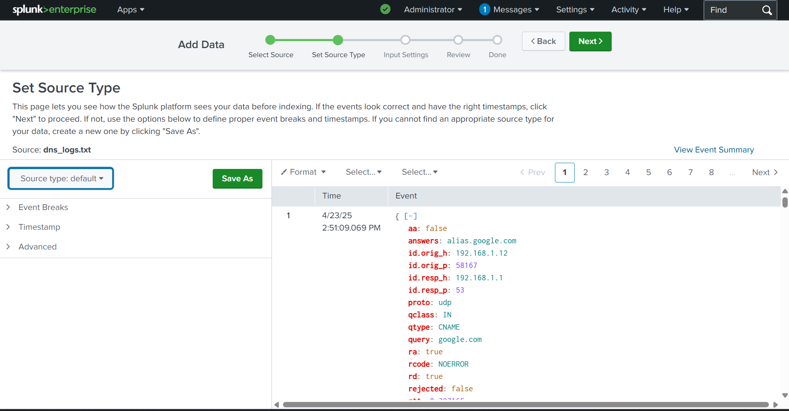

### Verify Data Ingestion

```spl
index=dns_lab
| head 5
```

### Screenshot

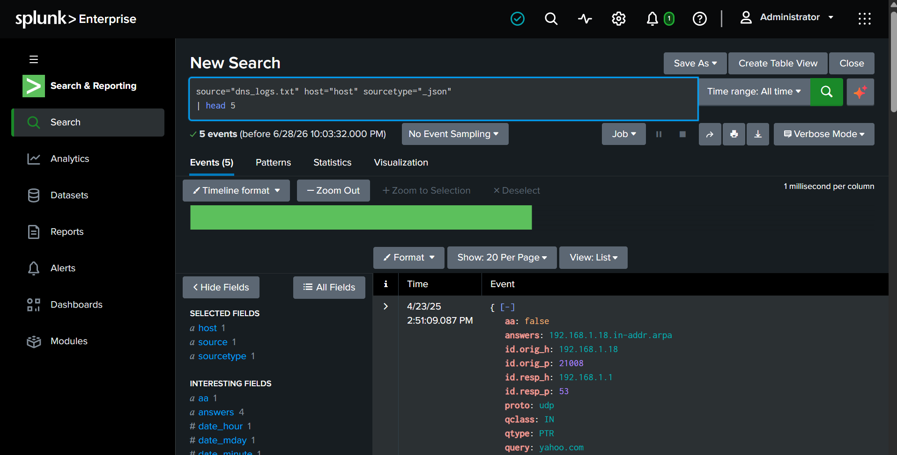

---

# Task 1 – DNS Traffic Overview

This section provides a high-level summary of DNS activity across the environment.

---

## Total DNS Queries

This panel displays the total number of DNS requests processed.

### SPL Query

```spl
source="dns_logs.txt" host="host" sourcetype="_json" 
|  stats count AS "Total DNS Queries"
```

### Security Insight

Monitoring total DNS requests establishes a baseline of normal activity. Sudden spikes may indicate malware communication, automated scripts, DNS tunneling, or reconnaissance.

### Screenshot

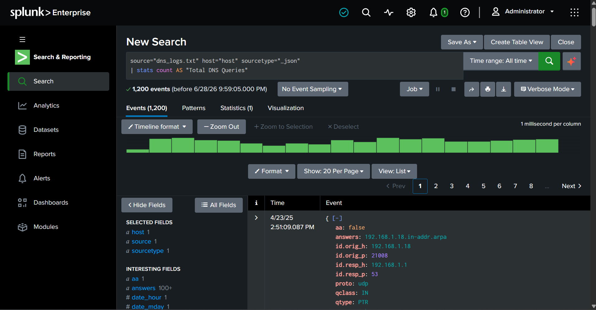


---

## Unique Domains Queried

This panel displays the number of unique domains queried.

### SPL Query

```spl
source="dns_logs.txt" host="host" sourcetype="_json" 
| stats dc(query) AS "Unique Domains"
```

### Security Insight

An unusually high number of unique domains within a short time period may indicate Domain Generation Algorithm (DGA) malware or automated scanning activity.

### Screenshot

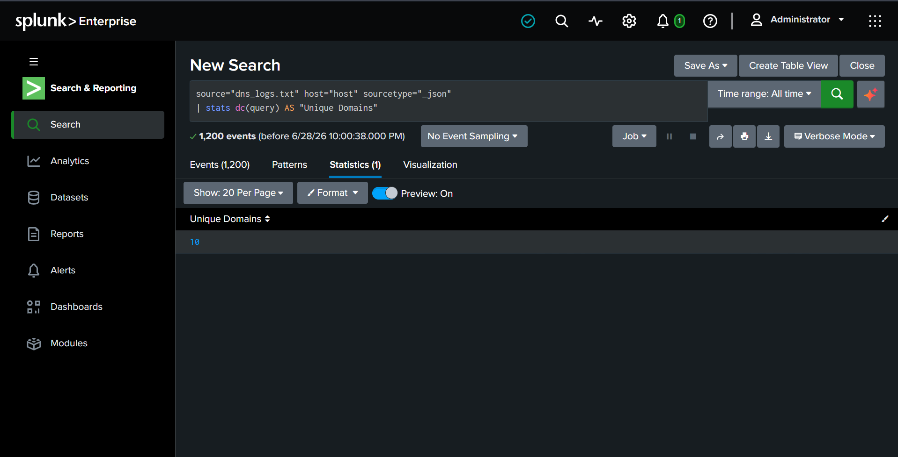

---

# Task 2 – Client Activity Analysis

This section focuses on identifying systems generating DNS traffic.

---

## Top Source IP Addresses

This visualization identifies the clients generating the highest number of DNS queries.

### SPL Query

```spl
source="dns_logs.txt" host="host" sourcetype="_json" 
| stats count AS Requests by id.orig_h
| sort -Requests
```

### Security Insight

Endpoints generating excessive DNS requests may indicate malware infections, automated tools, or compromised hosts.

### Screenshot

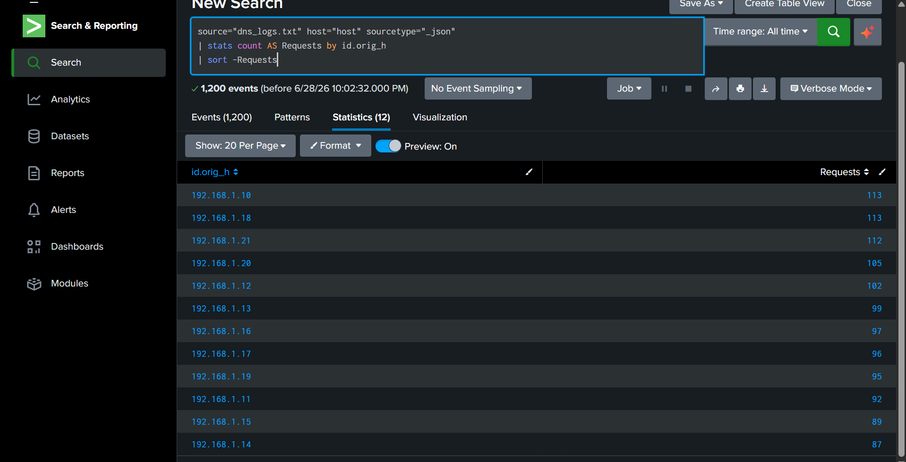

---

## DNS Servers Contacted

This visualization displays the DNS servers contacted by client systems.

### SPL Query

```spl
source="dns_logs.txt" host="host" sourcetype="_json" 
| stats count by id.resp_h
| sort -count
```

### Security Insight

Monitoring DNS server usage helps identify unauthorized DNS resolvers or clients bypassing enterprise DNS infrastructure.

### Screenshot

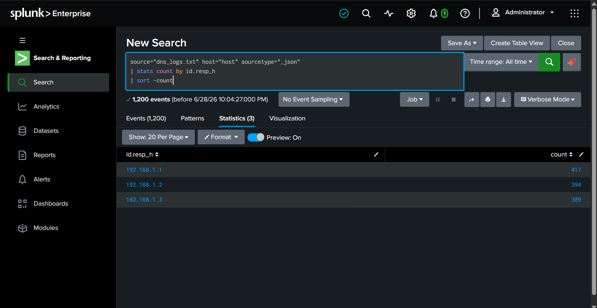

---

# Task 3 – DNS Query Analysis

This section analyzes DNS query characteristics.

---

## DNS Query Types

This visualization displays the distribution of DNS record types.

### SPL Query

```spl
source="dns_logs.txt" host="host" sourcetype="_json" 
| stats count by qtype
```

### Security Insight

Common DNS record types include:

* A
* AAAA
* CNAME
* MX
* PTR
* TXT

Unexpected spikes in TXT record queries may indicate DNS tunneling or malware communication.

### Screenshot

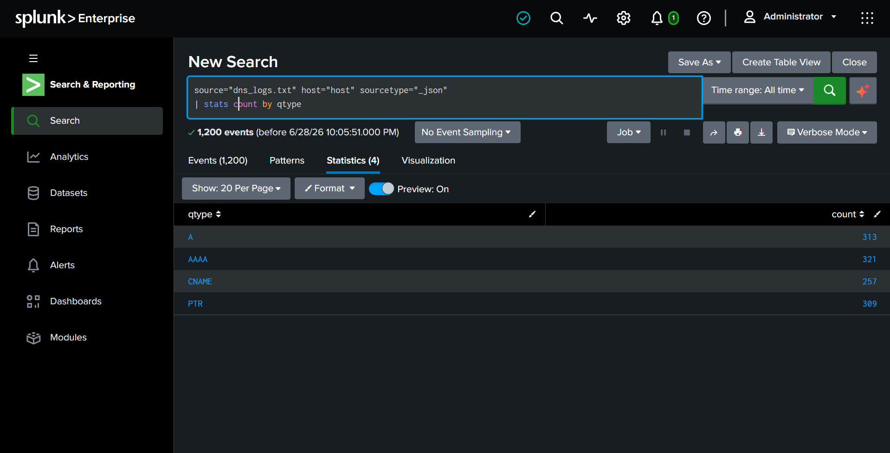

---

## DNS Response Time Analysis

This visualization measures DNS lookup latency.

### SPL Query

```spl
source="dns_logs.txt" host="host" sourcetype="_json" 
| stats avg(rtt) AS "Average RTT" max(rtt) AS "Maximum RTT"
```

### Security Insight

High DNS response times may indicate network congestion, slow DNS infrastructure, remote DNS servers, or potential DNS abuse.

### Screenshot

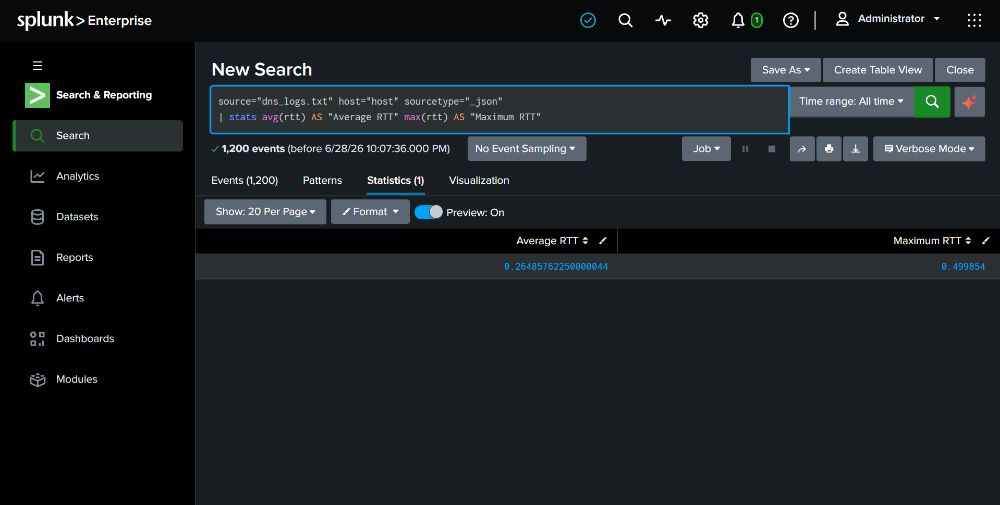

---

# Task 4 – Threat Hunting Queries

This section focuses on identifying suspicious DNS activity.

---

## Top Domains Returning Errors

This visualization identifies domains that frequently return DNS errors.

### SPL Query

```spl
source="dns_logs.txt" host="host" sourcetype="_json" 
| search rcode!=0
| stats count by query
| sort -count
```

### Security Insight

Repeated failed lookups for the same domain may indicate malware, typo-squatting, or misconfigured software repeatedly attempting DNS resolution.

### Screenshot

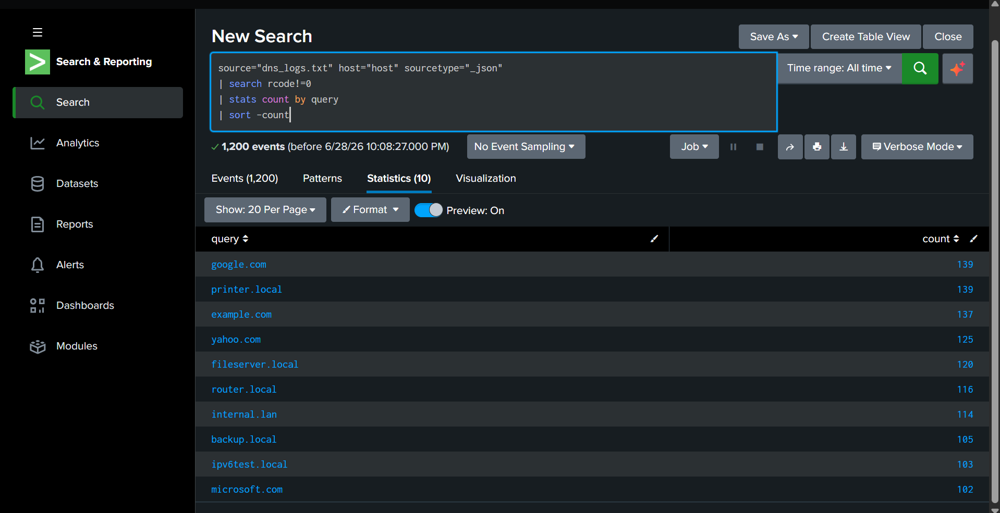

---

## Clients Querying the Most Unique Domains

This visualization identifies hosts querying an unusually large number of unique domains.

### SPL Query

```spl
source="dns_logs.txt" host="host" sourcetype="_json" 
| stats dc(query) AS Unique_Domains by id.orig_h
| sort -Unique_Domainss
```

### Security Insight

Endpoints querying hundreds or thousands of unique domains may be infected with malware using Domain Generation Algorithms (DGA) or performing automated reconnaissance.

### Screenshot

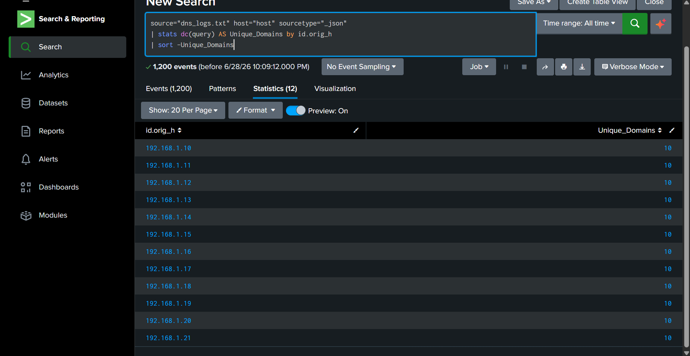

---

## Most Common DNS Answers

This visualization displays the most common DNS responses returned by DNS servers.

### SPL Query

```spl
source="dns_logs.txt" host="host" sourcetype="_json" 
| stats count by answers
| sort -count
```

### Security Insight

Reviewing DNS responses helps analysts understand common destinations and identify suspicious or unexpected IP addresses.

### Screenshot

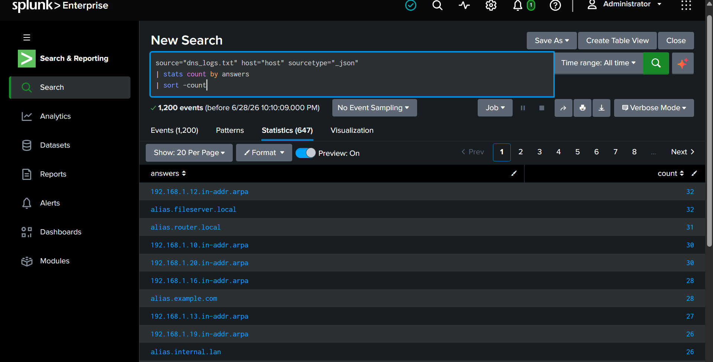

---

# Bonus Analysis

---

## DNS Activity Over Time

This visualization displays DNS activity over time and helps identify traffic spikes.

### SPL Query

```spl
source="dns_logs.txt" host="host" sourcetype="_json" 
| timechart span=1h count
```

### Security Insight

Time-based visualizations allow analysts to identify unusual spikes in DNS traffic that may correspond to malware execution, scheduled tasks, or network attacks.

### Screenshot

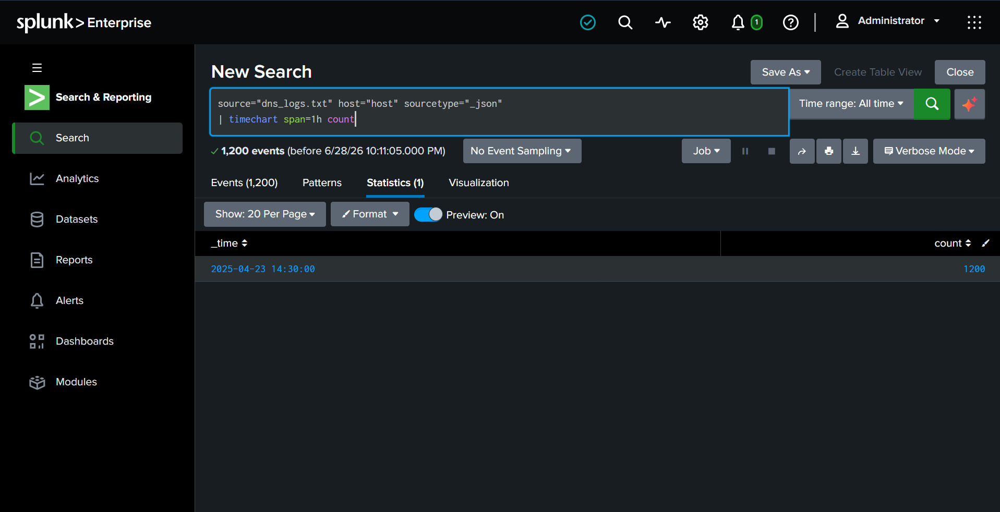

---

## Top 10 Longest DNS Response Times

This table displays DNS lookups with the highest response latency.

### SPL Query

```spl
source="dns_logs.txt" host="host" sourcetype="_json" 
| sort -rtt
| table _time id.orig_h query rtt
| head 10
```

### Security Insight

Slow DNS lookups may indicate network latency, overloaded DNS servers, or suspicious external DNS communication that requires further investigation.

### Screenshot

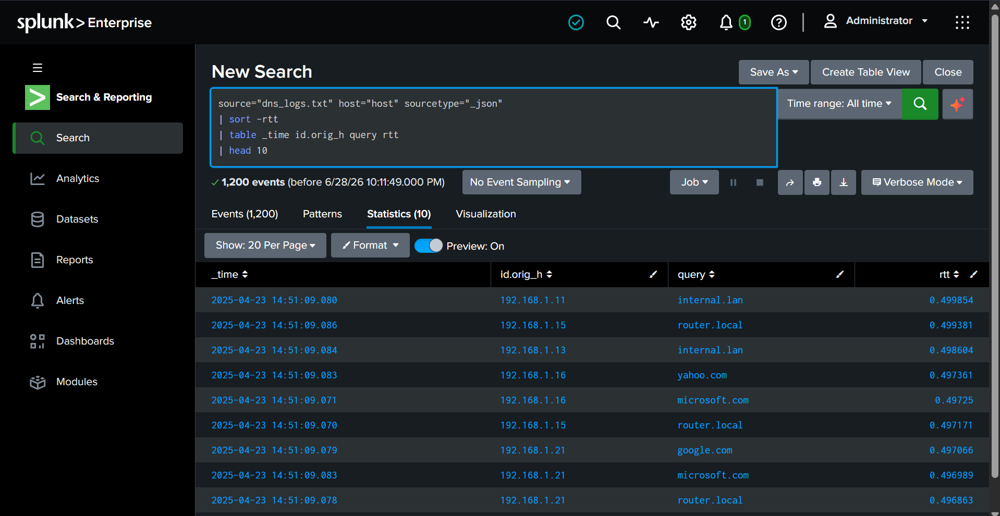

---

# Dashboard Summary

It includes rhe following visualizations:

* Total DNS Queries
* Unique Domains Queried
* DNS Query Types
* Most Common DNS Answers
* Response Times

### Dashboard Screenshot

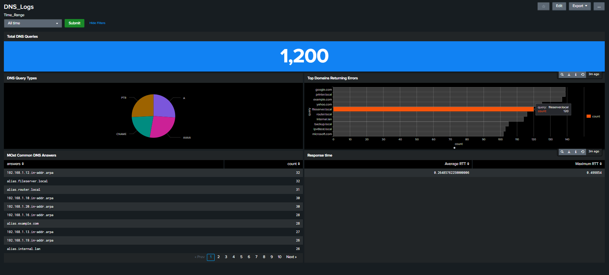
---

# Key Findings

During this project, I successfully:

* Imported Zeek DNS logs into Splunk Enterprise
* Parsed JSON DNS events
* Built multiple SPL searches for DNS investigations
* Identified frequently queried domains
* Investigated active client hosts
* Analyzed DNS record types
* Detected failed DNS resolutions
* Measured DNS response latency
* Investigated DNS server activity
* Applied practical DNS hunting techniques used by SOC analysts

---

# Skills Demonstrated

* Splunk Enterprise
* Search Processing Language (SPL)
* DNS Traffic Analysis
* Zeek Log Analysis
* Threat Hunting
* Network Security Monitoring
* Dashboard Development
* Log Investigation
* Security Monitoring
* Data Visualization

---

# Future Improvements

This project can be extended by implementing additional security-focused detections, including:

* DNS Tunneling Detection
* Domain Generation Algorithm (DGA) Detection
* Beaconing Detection
* Newly Registered Domain (NRD) Monitoring
* Suspicious TXT Record Detection
* Threat Intelligence Domain Matching
* Automated Splunk Alerts
* MITRE ATT&CK Mapping for DNS-based Attack Techniques

---

# Key Takeaways

This project demonstrates how Splunk transforms raw Zeek DNS logs into actionable security insights through SPL queries and visualizations. By analyzing DNS traffic, security analysts can establish normal network behavior, investigate suspicious domain activity, detect failed resolutions, identify abnormal client behavior, and uncover indicators of compromise such as DNS tunneling and malware communication.

Building this project strengthened my understanding of DNS protocols, Zeek log analysis, Splunk dashboard development, and practical investigation workflows commonly used by SOC analysts in real-world environments.
