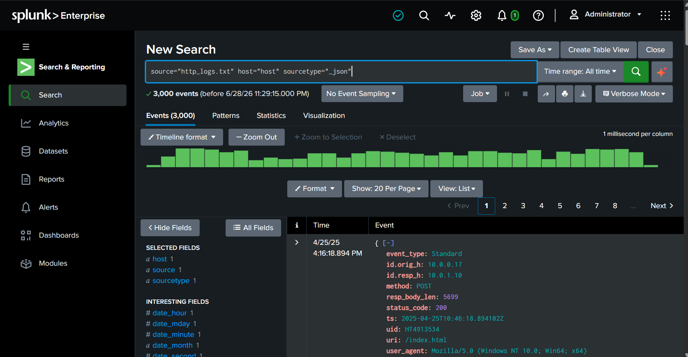
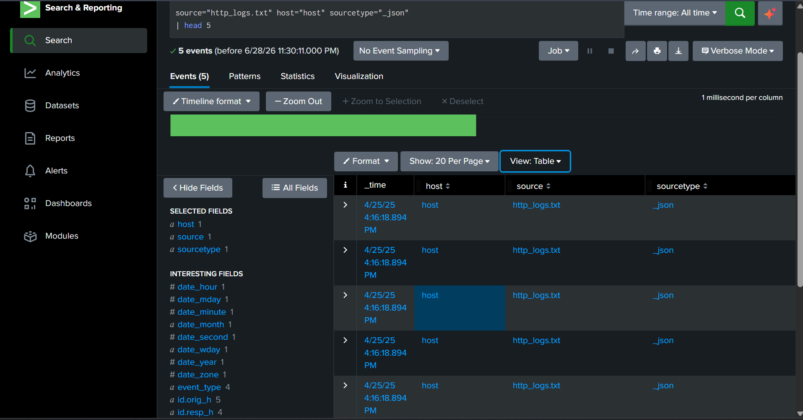
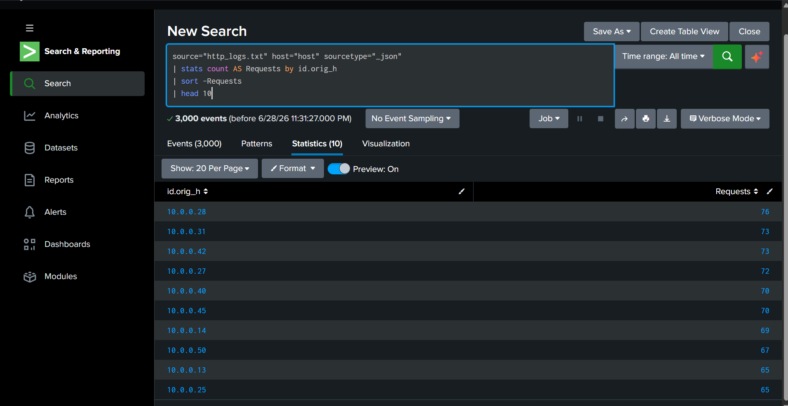
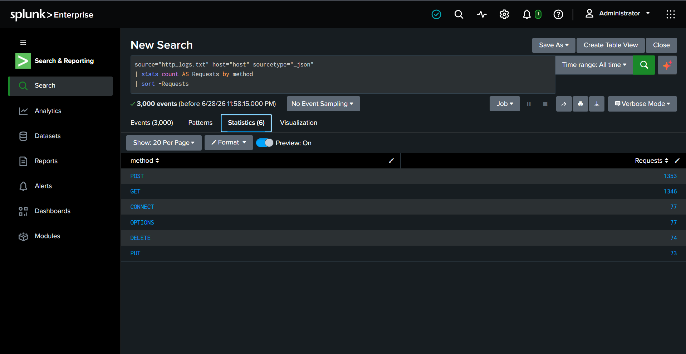
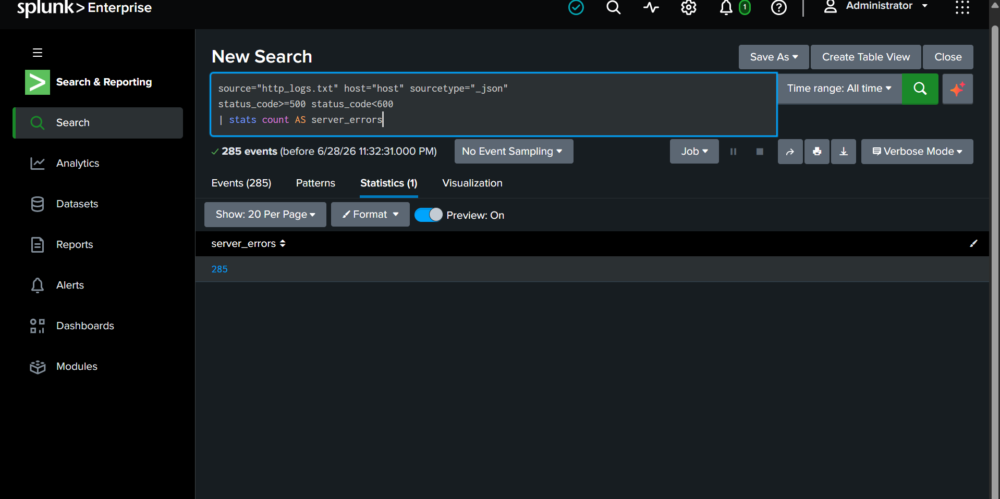
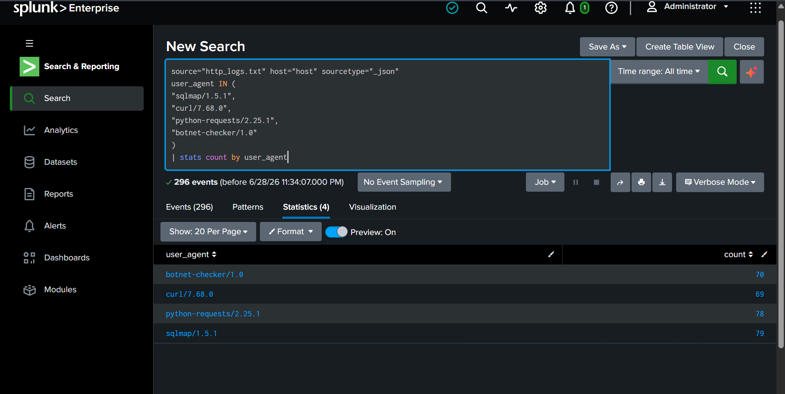
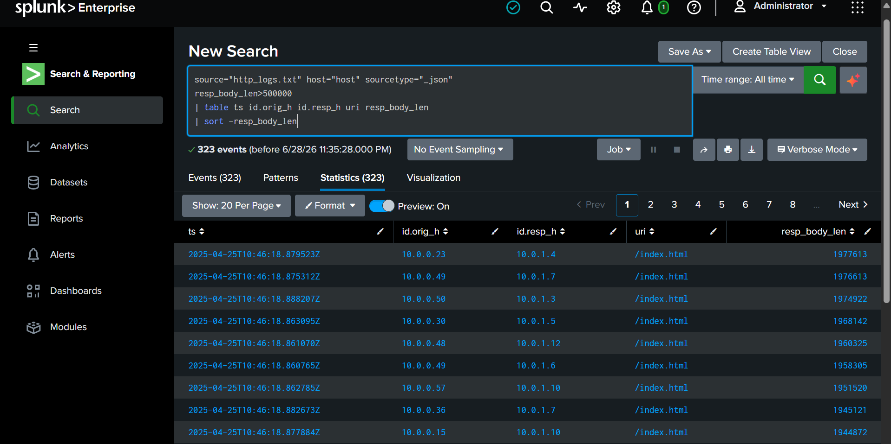
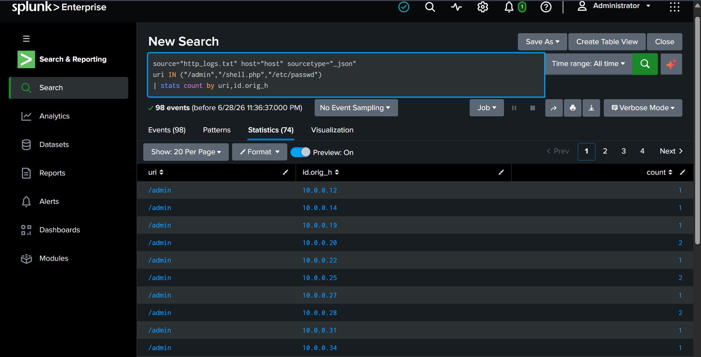
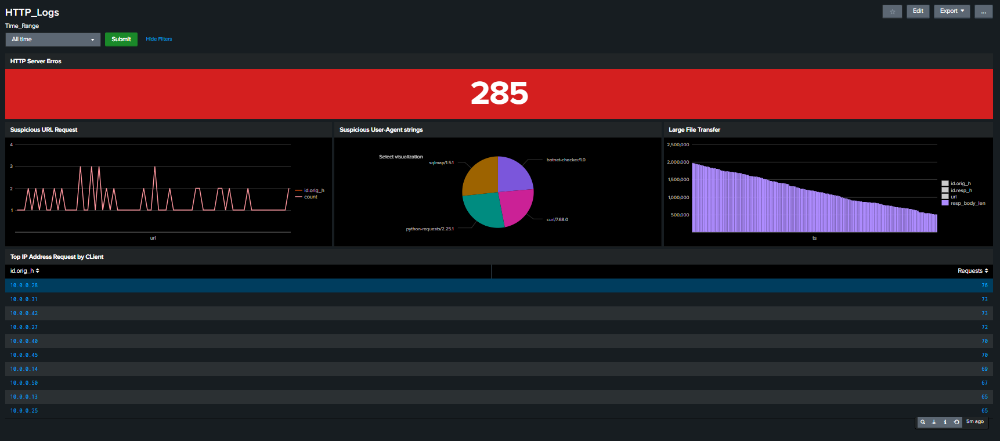

# Project 04 - HTTP Traffic Analysis Using Splunk

## Overview

Hypertext Transfer Protocol (HTTP) is the primary protocol used for communication between web clients and servers. HTTP logs contain valuable information about client requests, server responses, requested resources, response sizes, and client User-Agent strings. These logs are essential for Security Operations Center (SOC) analysts to monitor web activity, investigate suspicious requests, detect potential attacks, and identify abnormal traffic patterns.

In this project, HTTP logs generated from a Zeek network monitoring environment were ingested into Splunk Enterprise. Using Splunk Search Processing Language (SPL), multiple investigations were performed to analyze client activity, monitor server errors, identify suspicious User-Agent strings, investigate large file transfers, and detect requests targeting sensitive resources.

---

# Objectives

The objectives of this project are to:

* Import HTTP logs into Splunk Enterprise.
* Validate successful log ingestion.
* Analyze client HTTP traffic.
* Detect server-side errors.
* Identify suspicious User-Agent strings.
* Monitor large file transfers.
* Investigate requests to sensitive resources.
* Gain practical experience using Splunk SPL for HTTP traffic analysis.

---

# Lab Environment

| Component     | Details               |
| ------------- | --------------------- |
| SIEM Platform | Splunk Enterprise     |
| Dataset       | http_logs.json        |
| Log Format    | JSON (Zeek HTTP Logs) |
| Sourcetype    | json / zeek:http      |
| Index         | http_lab              |

---

# Step 1 - Import HTTP Logs

The HTTP dataset was uploaded into Splunk using the **Add Data** workflow.

### Navigation

```text
Settings → Add Data → Upload
```

### Configuration

* Select **http_logs.json**
* Set **Sourcetype** to **json** 
* Create or select the **http_lab** index
* Review the configuration and submit the upload



---

# Step 2 - Validate Log Ingestion

Before beginning the investigation, verify that the dataset has been indexed correctly.

### SPL Query

```spl
source="http_logs.txt" host="host" sourcetype="_json"
| head 5
```

### Why this query?

This search confirms that Splunk has successfully indexed the dataset and extracted the required fields.

### Security Insight

Validating data ingestion is the first step of every SOC investigation. Missing or incorrectly parsed logs can lead to inaccurate detections and incomplete investigations.



---

# Step 3 - Investigate Top Client IP Addresses

Identify the systems generating the highest volume of HTTP requests.

### SPL Query

```spl
source="http_logs.txt" host="host" sourcetype="_json"
| stats count AS Requests by id.orig_h
| sort -Requests
| head 10
```

### Why this query?

This query groups HTTP requests by client IP address to identify the most active systems communicating with the web server.

### Security Insight

Hosts generating unusually high request volumes may indicate:

* Automated vulnerability scanners
* Web crawlers
* Compromised systems
* Denial-of-Service (DoS) activity



---
# Step 4 - Analyze HTTP Request Methods

HTTP request methods describe the action a client wants the web server to perform. Monitoring request methods helps identify abnormal or potentially malicious behavior, such as unexpected use of methods that are rarely seen in normal web traffic.

### SPL Query

```spl
source="http_logs.txt" host="host" sourcetype="_json"
| stats count AS Requests by method
| sort -Requests
```

### Why this query?

This search groups HTTP events by request method and counts how frequently each method appears in the dataset.

### Security Insight

Most web applications primarily use **GET** and **POST** requests. Less common methods such as **PUT**, **DELETE**, **OPTIONS**, **CONNECT**, or **TRACE** may indicate:

- Application reconnaissance
- REST API interactions
- Misconfigured web servers
- WebDAV exploitation attempts
- Proxy tunneling
- Malicious or unexpected client behavior

Unexpected increases in uncommon HTTP methods should be investigated to determine whether they represent legitimate application functionality or suspicious activity.



---

# Step 5 - Analyze HTTP Server Errors

HTTP 5xx status codes indicate that the web server encountered an internal error while processing a request.

### SPL Query

```spl
source="http_logs.txt" host="host" sourcetype="_json"
status_code>=500 status_code<600
| stats count AS server_errors
```

### Why this query?

This search counts all server-side HTTP errors to help identify application failures or potential exploitation attempts.

### Security Insight

A sudden increase in HTTP 5xx responses may indicate:

* Application failures
* Backend service outages
* Resource exhaustion
* Attackers attempting to exploit vulnerable applications



---

# Step 6 - Identify Suspicious User-Agent Strings

Attackers often use automated tools when interacting with web applications. Many of these tools use recognizable User-Agent strings.

### SPL Query

```spl
source="http_logs.txt" host="host" sourcetype="_json"
user_agent IN (
"sqlmap/1.5.1",
"curl/7.68.0",
"python-requests/2.25.1",
"botnet-checker/1.0"
)
| stats count by user_agent
```

### Why this query?

This search identifies HTTP requests generated by commonly used penetration testing tools and automation frameworks.

### Security Insight

User-Agent strings associated with tools such as:

* sqlmap
* curl
* Python Requests
* Automated scanners


---

# Step 7 - Investigate Large File Transfers

Large HTTP responses can represent legitimate file downloads or potential indicators of data exfiltration. Monitoring unusually large transfers helps analysts identify abnormal activity that may require further investigation.

### SPL Query

```spl
source="http_logs.txt" host="host" sourcetype="_json"
resp_body_len>500000
| table ts id.orig_h id.resp_h uri resp_body_len
| sort -resp_body_len
```

### Why this query?

This search filters HTTP responses larger than **500 KB** and displays the source IP, destination server, requested URI, and response size.

### Security Insight

Large file transfers may indicate:

* Legitimate software downloads
* Backup file transfers
* Unauthorized data exfiltration
* Download of malicious payloads

Large outbound responses should always be validated against expected business activity.



---

# Step 8 - Detect Access to Sensitive Resources

Attackers frequently target administrative pages, web shells, configuration files, and sensitive system resources during reconnaissance or exploitation.

### SPL Query

```spl
source="http_logs.txt" host="host" sourcetype="_json"
uri IN ("/admin","/shell.php","/etc/passwd")
| stats count by uri,id.orig_h
```

### Why this query?

This search identifies requests made to commonly targeted administrative pages and sensitive files.

### Security Insight

Repeated requests to sensitive resources may indicate:

* Directory enumeration
* Web shell access attempts
* Local File Inclusion (LFI)
* Reconnaissance against web applications

Investigating these requests helps identify attackers before successful exploitation occurs.



---

# Dashboard Components

The following dashboard panels were created to provide a centralized view of HTTP activity:

| Dashboard Panel                | Purpose                                       |
| ------------------------------ | --------------------------------------------- |
| Total HTTP Requests            | Monitor overall web traffic volume            |
| Top Client IP Addresses        | Identify high-volume clients                  |
| HTTP Server Errors             | Monitor backend application health            |
| Suspicious User-Agent Activity | Detect automated tools and scanners           |
| Large File Transfers           | Identify unusually large HTTP responses       |
| Suspicious URI Requests        | Detect requests targeting sensitive resources |




---

# Key Findings

During this investigation, the following observations were made:

* Successfully ingested Zeek HTTP logs into Splunk.
* Validated log ingestion and field extraction.
* Identified the most active client IP addresses.
* Monitored HTTP server-side errors (5xx).
* Detected suspicious User-Agent strings associated with automation tools.
* Investigated large HTTP file transfers.
* Identified requests targeting administrative and sensitive resources.
* Visualized HTTP traffic patterns using time-based analysis.

These findings demonstrate how HTTP logs can provide valuable insight into web application activity and support security investigations.

---

# Skills Demonstrated

This project demonstrates hands-on experience with:

* Splunk Enterprise
* Search Processing Language (SPL)
* HTTP Traffic Analysis
* Zeek Network Monitoring
* Web Log Investigation
* Threat Hunting
* Dashboard Development
* Security Monitoring
* Security Event Analysis

---

# Detection Opportunities

The HTTP dataset can be leveraged to detect additional attack techniques by creating searches for:

* SQL Injection attempts
* Cross-Site Scripting (XSS)
* Directory Brute Force
* Web Shell Access
* HTTP Method Abuse
* Suspicious File Downloads
* User-Agent Anomalies
* Large Outbound Transfers

These detections can be implemented as scheduled searches or real-time alerts within Splunk.

---

# Key Takeaways

This project demonstrates how HTTP traffic can be analyzed using Splunk to identify suspicious web activity and support incident investigations. By examining client requests, server responses, User-Agent strings, response sizes, and requested resources, analysts can detect abnormal behavior, investigate potential attacks, and improve visibility into web application traffic.

The techniques demonstrated in this project represent common SOC analyst workflows and provide a strong foundation for building more advanced detections, including SQL Injection, web shell activity, and HTTP-based command-and-control detection.

