# Project 05 - Windows Security Monitoring Using Splunk

## Overview

Windows Security logs record authentication events, account changes, privilege assignments, and other security-related activities. In this project, I used the **Splunk Boss of the SOC (BOTS)** dataset to monitor Windows authentication events and investigate suspicious login activity using Splunk.

The goal of this project is to build practical SOC detections by analyzing Windows Security Event Logs and creating dashboards that help monitor authentication events.

---

# Objectives

In this project, I will:

* Import Windows Security logs into Splunk
* Validate log ingestion
* Analyze successful and failed logins
* Detect brute-force activity
* Monitor account lockouts
* Detect new user creation
* Monitor privileged logons
* Build a security dashboard

---

# Lab Environment

| Component  | Details                 |
| ---------- | ----------------------- |
| SIEM       | Splunk Enterprise       |
| Dataset    | Splunk BOTS             |
| Log Source | Windows Security Logs   |
| Sourcetype | XmlWinEventLog:Security |
| Index      | wineventlog             |

---

# Important Event IDs

| Event ID | Description                 |
| -------- | --------------------------- |
| 4624     | Successful Logon            |
| 4625     | Failed Logon                |
| 4672     | Special Privileges Assigned |
| 4720     | User Account Created        |
| 4740     | Account Locked              |
| 4768     | Kerberos Authentication     |
| 4769     | Kerberos Service Ticket     |

---

# Step 1 - Import Windows Security Logs

Upload the Windows Security log dataset into Splunk.

### Configuration

* Upload the log file
* Sourcetype: `XmlWinEventLog:Security`
* Index: `wineventlog`
* Complete the upload

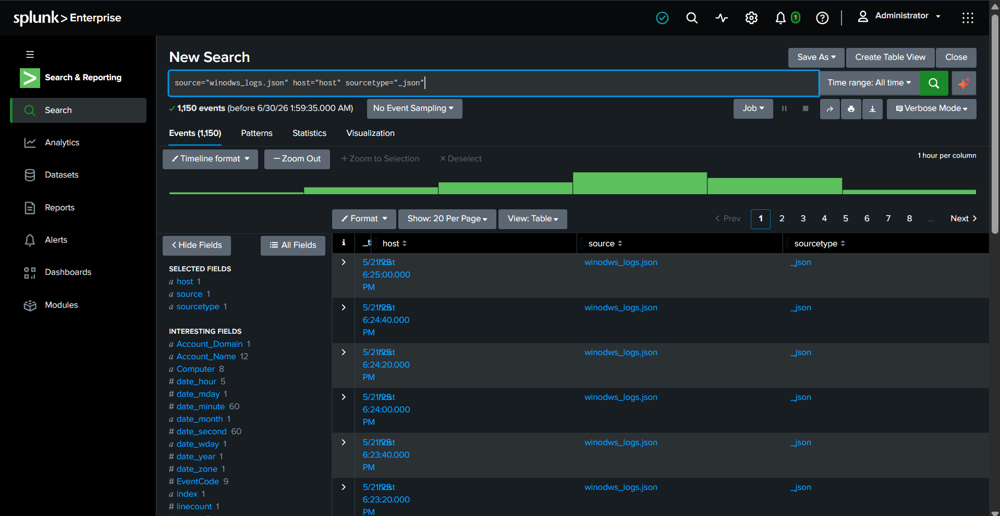

---

# Step 2 - Validate Log Ingestion

Before starting the analysis, verify that the logs are indexed correctly.

### SPL Query

```spl
index=main source="winodws_logs.json"
| head 10
```

### Why?

This confirms that the logs were successfully ingested and the fields are available for searching.

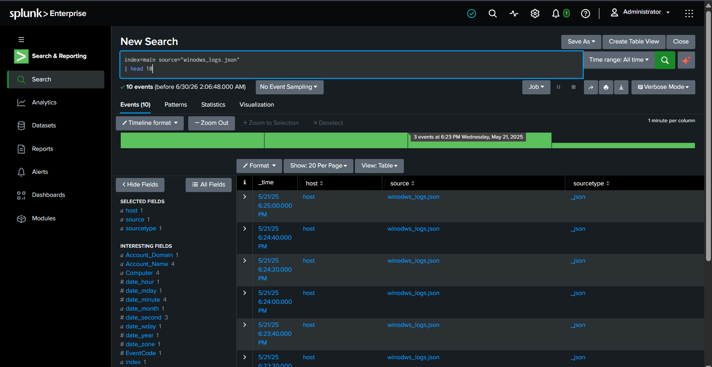

---

# Step 3 - Analyze Successful Logons (Event ID 4624)

Successful logons help identify normal authentication activity and active user accounts.

### SPL Query

```spl
index=main source="winodws_logs.json"
EventCode=4624
| stats count by Account_Name, host
| sort -count
```

### Why?

Shows which users logged in most frequently and the systems they accessed.

### Security Note

Unexpected successful logins or unusual login locations should be investigated.

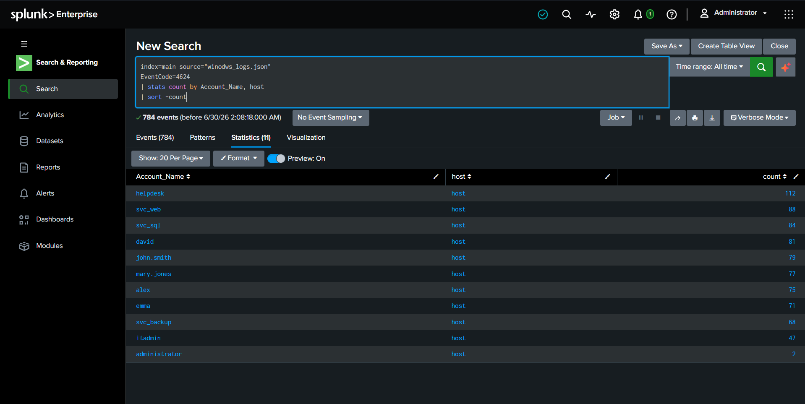

---

# Step 4 - Analyze Failed Logons (Event ID 4625)

Failed logons are commonly monitored because they can indicate password guessing or brute-force attacks.

### SPL Query

```spl
index=main source="winodws_logs.json"
EventCode=4625
| stats count by Account_Name, src_ip
| sort -count
```

### Why?

Lists the users and source IP addresses generating the most failed login attempts.

### Security Note

A large number of failed logins from the same IP or against the same account may indicate malicious activity.

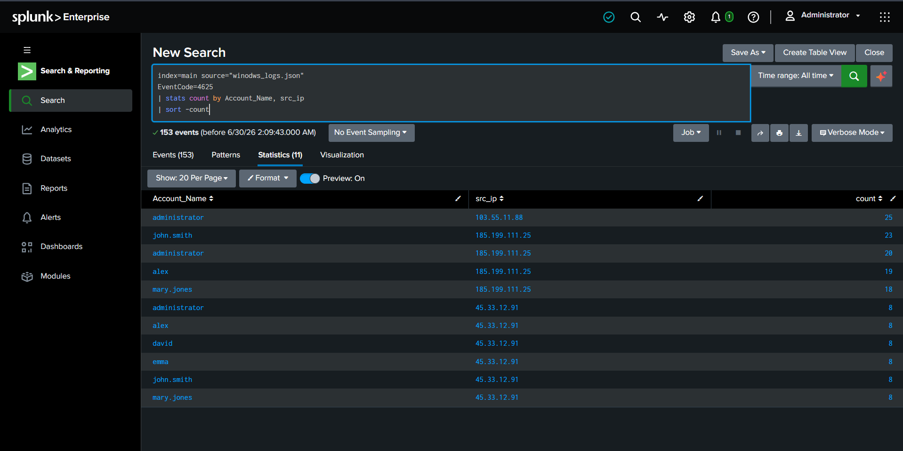

---

# Step 5 - Compare Successful vs Failed Logons

Compare authentication events to get a quick overview of login activity.

### SPL Query

```spl
index=main source="winodws_logs.json"
EventCode IN (4624,4625)
| eval Status=if(EventCode=4624,"Successful","Failed")
| stats count by Status
```

### Why?

Provides a simple comparison between successful and failed authentication attempts.

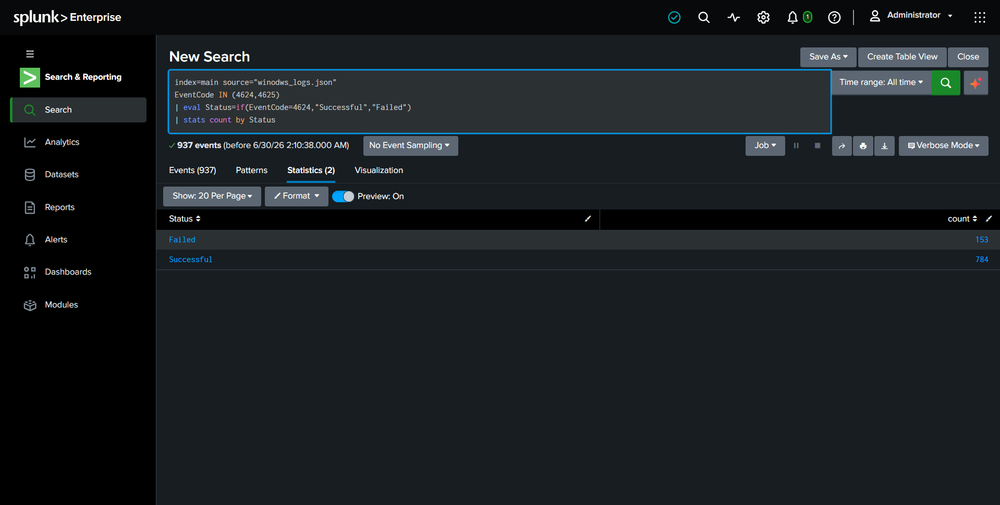

---

# Step 6 - Detect Brute Force Attacks

Multiple failed logins from the same source are one of the most common signs of a brute-force attack.

### SPL Query

```spl
index=main source="winodws_logs.json"
EventCode=4625
| stats count AS Failed_Attempts by src_ip
| where Failed_Attempts>=5
| sort -Failed_Attempts
```

### Why?

Shows IP addresses generating multiple failed logins.

### Security Note

Repeated authentication failures from the same IP should be investigated for brute-force or password spraying attacks.

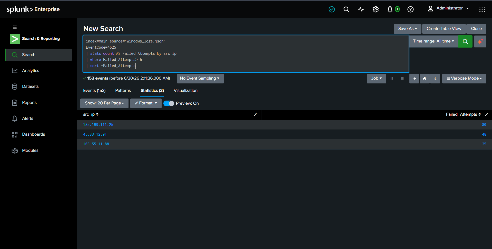

---

# Step 7 - Monitor Account Lockouts (Event ID 4740)

Windows generates Event ID **4740** whenever an account is locked after too many failed login attempts.

### SPL Query

```spl
index=main source="winodws_logs.json"
EventCode=4740
| stats count by Account_Name, host
```

### Why?

Lists all locked user accounts and the affected systems.

### Security Note

Frequent account lockouts may indicate brute-force activity or repeated login failures.

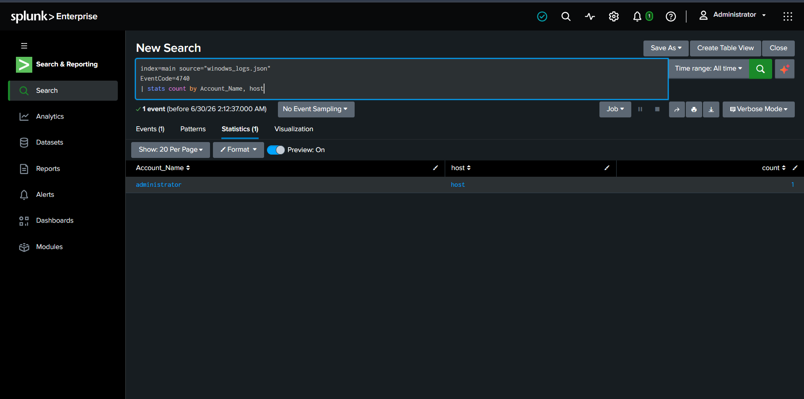

---

# Step 8 - Detect Newly Created User Accounts (Event ID 4720)

Attackers sometimes create new user accounts to maintain persistence after compromising a system.

### SPL Query

```spl
index=main source="winodws_logs.json"
EventCode=4720
| table _time Account_Name Subject_Account_Name host
```

### Why?

Displays all newly created user accounts.

### Security Note

Unexpected account creation should always be verified with system administrators.

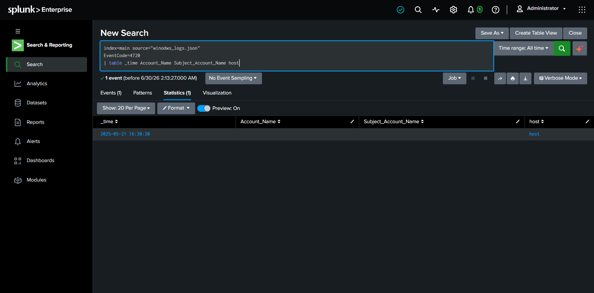

---

# Step 9 - Monitor Privileged Logons (Event ID 4672)

Event ID **4672** indicates that special privileges were assigned during logon.

### SPL Query

```spl
index=main source="winodws_logs.json"
EventCode=4672
| stats count by Account_Name, host
| sort -count
```

### Why?

Shows users receiving administrative or elevated privileges.

### Security Note

Unexpected privileged logons may indicate administrator account misuse or privilege escalation.

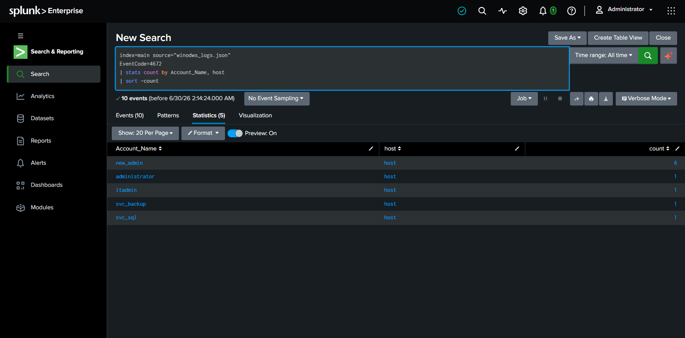

---

# Step 10 - Analyze Windows Logon Types

Windows records different logon types depending on how users access the system.

| Logon Type | Description |
|------------|-------------|
|2|Interactive Login|
|3|Network Login|
|4|Batch Job|
|5|Service|
|7|Unlock Workstation|
|8|Network Cleartext|
|10|Remote Desktop (RDP)|
|11|Cached Credentials|

### SPL Query

```spl
index=main source="winodws_logs.json"
EventCode=4624
| stats count by Logon_Type
| sort -count
```

### Why?

Shows the distribution of Windows logon types.

### Security Note

Unexpected Remote Desktop (Type 10) or Service logons (Type 5) may require further investigation.

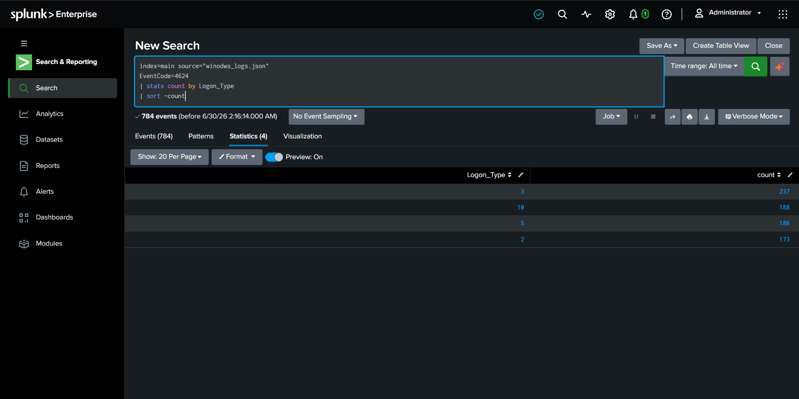

---

# Step 11 - Build a Security Dashboard

Create a Splunk dashboard to monitor Windows authentication events.

## Dashboard Panels

- Total Successful Logons
- Total Failed Logons
- Brute Force Attempts
- Account Lockouts
- New User Accounts
- Logon Type Distribution
- Failed Login Timeline

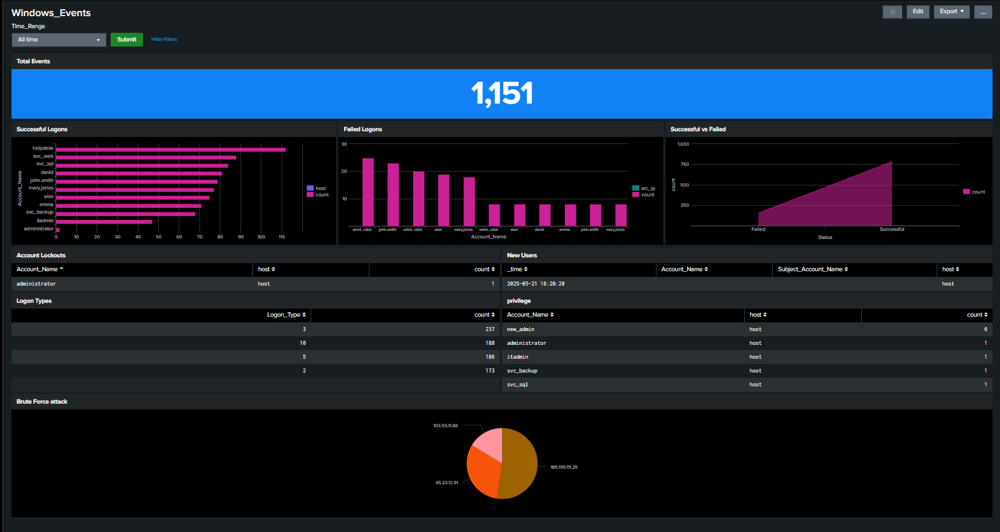

---

# Optional Splunk Alerts

### Alert 1 - Brute Force Detection

Trigger when:

- More than **5 failed logins**
- From the same IP
- Within **10 minutes**

---

### Alert 2 - New User Account

Trigger whenever Event ID **4720** is detected.

---

### Alert 3 - Privileged Logon

Trigger whenever Event ID **4672** occurs outside business hours.

---

### Alert 4 - Account Lockout

Trigger whenever Event ID **4740** is generated.

---

## Key Findings

During this investigation, I was able to:

- Validate Windows Security Event Logs in Splunk.
- Monitor successful and failed authentication attempts.
- Detect multiple failed logins that may indicate brute-force attacks.
- Identify locked user accounts.
- Detect newly created user accounts.
- Monitor privileged logons.
- Analyze Windows logon types.
- Build dashboards for authentication monitoring.

---

# Skills Demonstrated

This project helped me gain hands-on experience with:

- Splunk Search Processing Language (SPL)
- Windows Security Event Analysis
- Authentication Monitoring
- Brute Force Detection
- Windows Event IDs
- Dashboard Creation
- Alert Configuration
- Threat Detection
- Log Analysis
- MITRE ATT&CK Mapping

---

# Detection Opportunities

The following detections can be implemented using these logs:

| Detection | Event ID |
|-----------|----------|
| Failed Logon Detection | 4625 |
| Successful Logon Monitoring | 4624 |
| Brute Force Detection | 4625 |
| Account Lockout Detection | 4740 |
| New User Detection | 4720 |
| Privileged Logon Detection | 4672 |
| Logon Type Monitoring | 4624 |

---

# Future Improvements

Possible improvements for this project include:

- Detect Password Spraying attacks.
- Correlate failed logins followed by successful authentication.
- Monitor RDP logons from unusual hosts.
- Detect privilege escalation attempts.
- Integrate threat intelligence for malicious IP detection.
- Correlate Windows logs with Sysmon events.
- Build risk-based alerts for high-value accounts.

---

# Key Takeaways

This project demonstrates how Windows Security Event Logs can be used to monitor authentication activity, detect suspicious behavior, and improve visibility across Windows systems.

By using Splunk dashboards, alerts, and SPL queries, security analysts can quickly identify brute-force attacks, account misuse, and privileged account activity.

---

# Project Summary

| Category | Details |
|----------|---------|
| SIEM | Splunk Enterprise |
| Dataset | Splunk Boss of the SOC (BOTS) |
| Platform | Windows |
| Log Source | Windows Security Logs |
| Event IDs | 4624, 4625, 4672, 4720, 4740 |
| Dashboards | Authentication Monitoring |
| Alerts | Brute Force, Account Lockout, New User |
| MITRE ATT&CK | Credential Access, Persistence, Privilege Escalation |


