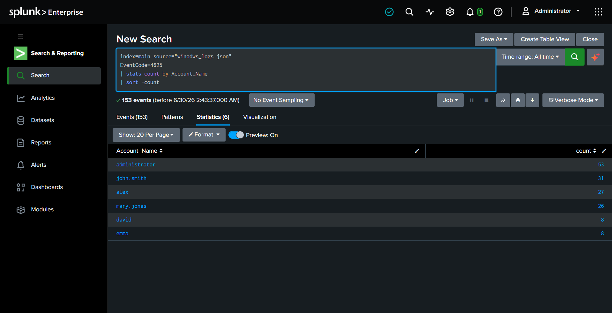
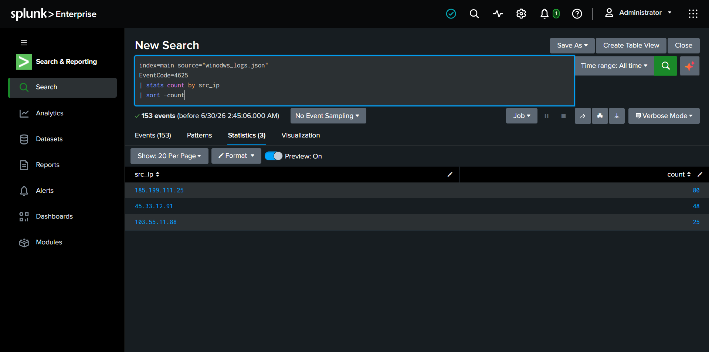
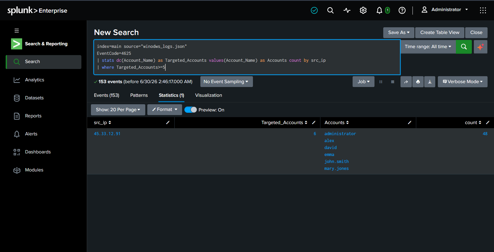
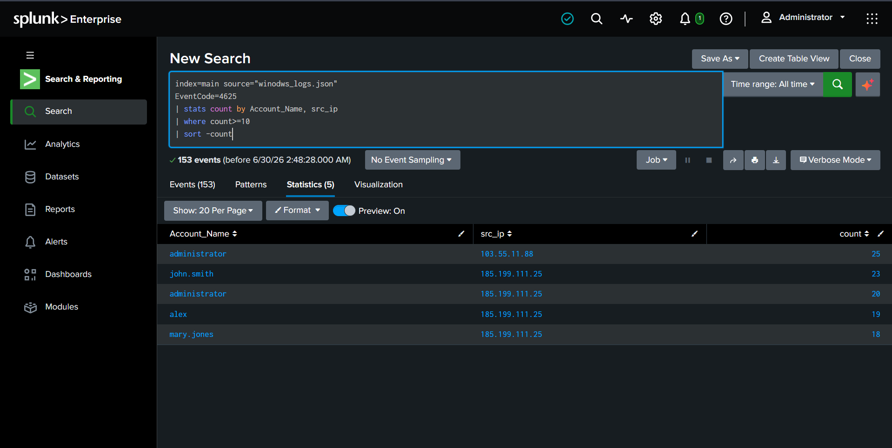
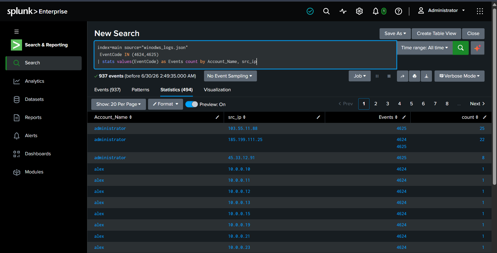
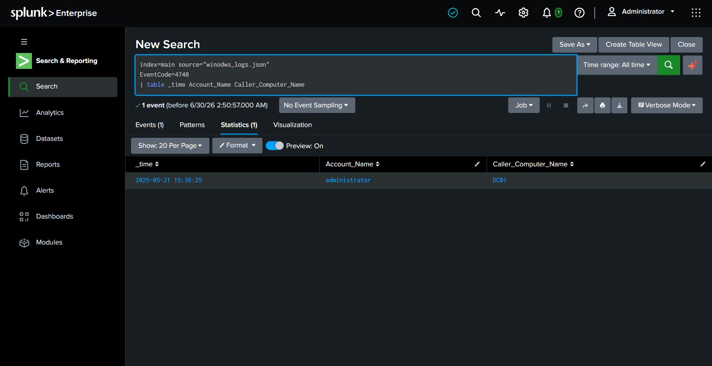
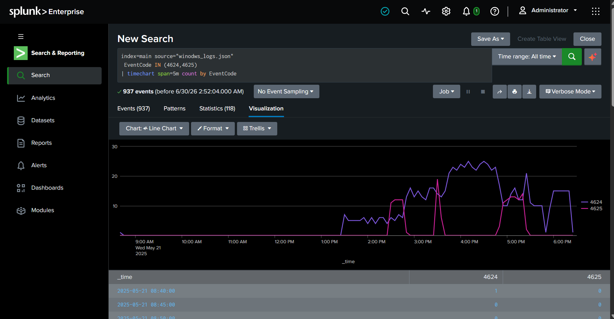
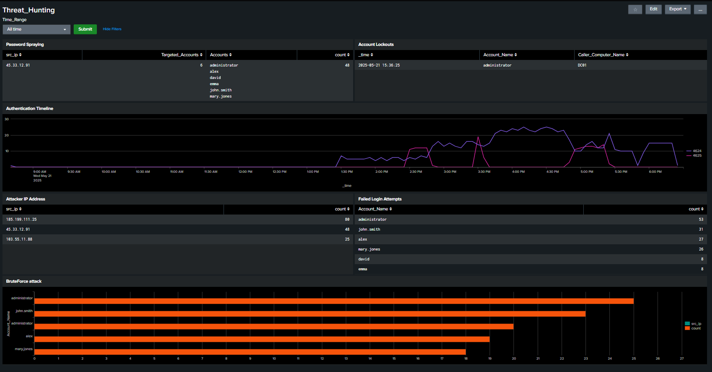

# Project 06 - Threat Hunting: Brute Force Attack Detection

## Objective

In this project, you will investigate Windows Security Event Logs to detect brute-force attacks, password spraying, and suspicious authentication activity.

---

## Dataset

Same as Lab5 - Windows Security Monitoring**.

```
datasets/windows_logs.json
```

# Verify the logs are indexed correctly.

```spl
index=index=main source="winodws_logs.json"
| stats count
```

---

# Task 1 - Identify Failed Login Attempts

## Goal

Find accounts experiencing failed authentication attempts.

### SPL Query

```spl
index=main source="winodws_logs.json" 
EventCode=4625
| stats count by Account_Name
| sort -count
```

### Expected Outcome

- Most targeted accounts
- Total failed login attempts

#### Screenshot



---

# Task 2 - Detect Top Attacker IP Addresses

## Goal

Identify source IPs generating the highest number of failed logins.

### SPL Query

```spl
index=main source="winodws_logs.json" 
EventCode=4625
| stats count by src_ip
| sort -count
```

### Screenshot



---

# Task 3 - Detect Password Spraying

## Goal

Find one IP attempting to authenticate against multiple accounts.

### SPL Query

```spl
index=main source="winodws_logs.json" 
EventCode=4625
| stats dc(Account_Name) as Targeted_Accounts values(Account_Name) as Accounts count by src_ip
| where Targeted_Accounts>=5
```

### Expected Outcome

Identify attacker IPs targeting several users.

### Screenshot



---

# Task 4 - Detect Brute Force Attacks

## Goal

Find repeated failed login attempts against the same account.

### SPL Query

```spl
index=main source="winodws_logs.json" 
EventCode=4625
| stats count by Account_Name, src_ip
| where count>=10
| sort -count
```

### Expected Outcome

Identify accounts under brute-force attack.

### Screenshot



---

# Task 5 - Detect Successful Login After Multiple Failures

## Goal

Identify accounts that eventually authenticated successfully after repeated failures.

### SPL Query

```spl
index=main source="winodws_logs.json" 
 EventCode IN (4624,4625)
| stats values(EventCode) as Events count by Account_Name, src_ip
```

### Investigation

Review accounts where both **4625** and **4624** are present.

These may indicate compromised credentials.

### Screenshot



---

# Task 6 - Investigate Account Lockouts

## Goal

Detect user accounts that became locked.

### SPL Query

```spl
index=main source="winodws_logs.json" 
EventCode=4740
| table _time Account_Name Caller_Computer_Name
```

### Expected Outcome

Identify users locked due to excessive failed logins.

### Screenshot



---

# Task 7 - Authentication Timeline

## Goal

Visualize authentication activity over time.

### SPL Query

```spl
index=main source="winodws_logs.json" 
 EventCode IN (4624,4625)
| timechart span=5m count by EventCode
```

### Visualization



---

# Task 8 - Build Dashboard

Create a dashboard containing:

- Failed Login Attempts
- Successful Logins
- Top Attacker IPs
- Password Spraying Detection
- Brute Force Detection
- Account Lockouts
- Authentication Timeline

### Screenshot



---


# Task 9 - Create Alert

Create a scheduled alert.

### Condition

- More than 10 failed logins from the same IP within 10 minutes.

### SPL Query

```spl
index=main source="winodws_logs.json" 
EventCode=4625
| bucket span=10m _time
| stats count by _time, src_ip
| where count>10
```

---

# Skills Learned

- Authentication Monitoring
- Threat Hunting
- Brute Force Detection
- Password Spraying Detection
- Event Correlation
- Dashboard Development
- Alert Creation
- Windows Security Monitoring
- Splunk SPL

---

# Conclusion

In this project, you investigated Windows authentication events to identify brute-force attacks and suspicious login activity. Using Splunk, you correlated failed and successful logins, detected password spraying, monitored account lockouts, and created dashboards and alerts to improve visibility into authentication-based threats.

These techniques are commonly used by SOC analysts to detect account compromise and investigate authentication attacks in enterprise environments.